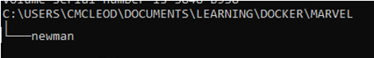

# To run Marvel API tests with Postman/Newman and Docker

## Prerequisites
* Export/share test collection
* Export environment
* Setup a file tree with newman directory



## To run
* Copy exported environment to newman directory
* **OPTIONAL** copy collection to newman directory, although collection link can be used
* Command prompt:
    - -v is mounting the directory so that it is visible to the image.
    - -e is setting the environment
    -   With local collection
    ```
    docker run -v C:/Users/cmcleod/Documents/Learning/Docker/Marvel/newman:/etc/newman postman/newman run <your_collection>.json -e <your_env>.json
    ```
    - With collection link
    ```
    docker run -v C:/Users/cmcleod/Documents/Learning/Docker/Marvel/newman:/etc/newman postman/newman run <your_collection_link> -e <your_env>.json
    ```